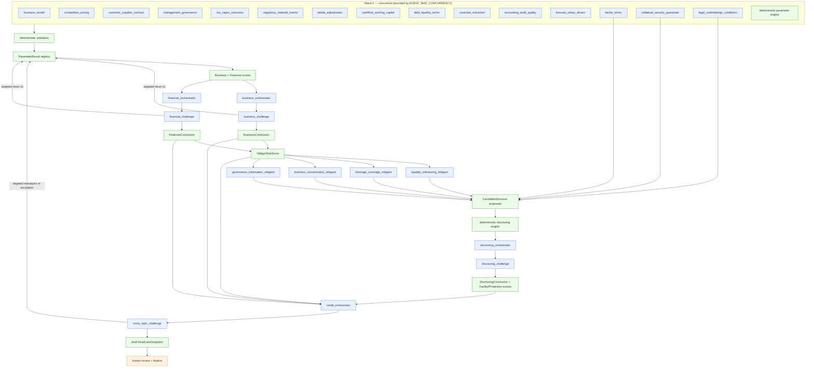
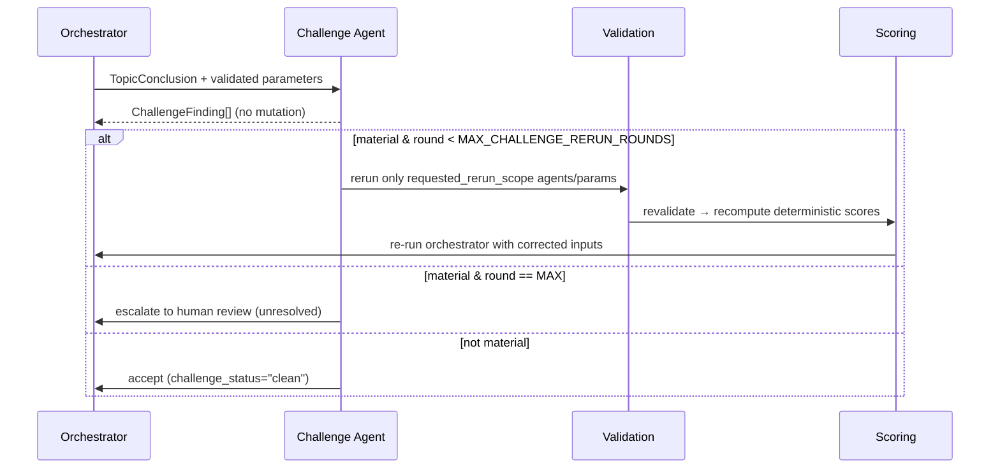

# Design — Agentic Credit Analysis + Deterministic Scoring

## Overview

This design extends the existing credit-memo pipeline by replacing only the
**downstream analytical portion** (`CreditMemoPipeline._ai()`) with a bounded,
concurrent multi-agent architecture over a deterministic parameter, validation
and scoring substrate. Everything up to and including the human-reviewed
`CanonicalEvidenceSnapshot` is unchanged.

The architecture is deliberately deterministic-first:

> Code is the calculator, rule engine, scenario engine, scoring engine and policy
> gate. LLMs are interpreters, classifiers, challengers and synthesizers.

### What exists today (baseline, unchanged)

- `CanonicalEvidenceSnapshot` (schema v1.1, `app/schemas/snapshots.py`) — the
  immutable, human-reviewed hand-off object. Persisted in `snapshots`
  (`snapshot_type="canonical_evidence"`).
- Deterministic stack: `MetricEngine` + `MetricDefinitionRegistry`
  (`app/services/metrics/`), `TrendAnalyzer`, `PeerBenchmarker`
  (`app/services/benchmarking/peers.py`), `Reconciler`
  (`app/services/reconciliation/`), `PolicyRuleEvaluator` + `RuleRegistry`
  (`app/services/escalation/rules.py`), `EscalationEngine`
  (`app/services/escalation/engine.py`).
- Single AI choke point: `LLMClient` (`extract`/`analyze`/`challenge`) over
  `LLMBackend` with `FakeLLMBackend` (tests) and `RealProviderBackend`
  (OpenAI/compatible). Every run is schema-validated-before-use and logged to
  `model_runs` + `stage_artifacts` + `audit_events` (`app/services/llm/`).
- Versioned registries: `ConfigRegistry` (9 artifacts in `config/poc/*`),
  `PromptRegistry`, `MetricDefinitionRegistry` — all append-only + content-hashed.
- Immutable finalization: `FinalSnapshotAssembler` with a `before_flush`
  immutability guard; `finalize` requires a persisted human sign-off and no open
  mandatory escalation (`app/services/review/finalization.py`).
- Read-only `WorkbenchService` (`/cases`) and mutating local review surface
  `/inspect` (`app/api/inspection.py`, `app/api/workbench.py`).

### What this feature adds

New service packages (names adapt to repo conventions; prefer extension over
duplication):

```
app/services/agents/        registry, router, executor, runtime, validation, cache
app/services/parameters/    business, financial, structuring, registry (deterministic Parameter Engine)
app/services/scoring/       engine, overlays (deterministic scoring)
app/services/orchestration/ business, financial, structuring, credit, challenge_loop
app/services/structuring/   candidates, engine, stress (deterministic feasibility)
app/services/llm/providers_vertex.py   VertexProviderBackend(LLMBackend)
```

New typed contracts (`app/schemas/agentic.py` or similar): `ParameterResult`,
`AgentTask`, `AgentRun`, `TopicConclusion`, `ChallengeFinding`,
`CandidateStructure`, and the five scores. New ORM tables for persistence. A new
versioned config artifact `scoring` (`config/poc/scoring.json`) and a
`router_version`.

`CreditMemoPipeline._ai()` becomes a thin façade that, under
`analysis_mode="agentic"`, delegates to the orchestration services; under
`analysis_mode="legacy"` it runs the existing path unchanged.

---

## Architecture

### System-level data flow

```text
                 (unchanged baseline)                 |            (this feature)
SOURCE DOCS → INGEST/ENTITY/CUTOFF → PARSE → RECONCILE |
   → CanonicalEvidenceSnapshot (human-reviewed, immutable)
                        │
                        ▼
                EVIDENCE ROUTER  ── router_version, packet_hash ──┐
                        │                                         │
      ┌─────────────────┼───────────────────────────┐            │ cross-cutting:
      ▼                 ▼                             ▼            │  - AgentRun log
 DETERMINISTIC     NARROW LLM AGENTS           EARLY STRUCTURING   │  - append-only audit
 PARAMETER ENGINE  (Business×6, Financial×6)   EXTRACTION ×3       │  - cache/idempotency
 (metrics, HHI,         │                             │           │  - config/prompt/model
  trends, stress)       ▼                             │           │    versions + hashes
      │           deterministic VALIDATION ───────────┤           │  - token/latency usage
      └────────────────►│                             │           │
                        ▼                             │           │
              ParameterResult REGISTRY ───────────────┘           │
                        │                                         │
                        ▼                                         │
              DETERMINISTIC SCORING                                │
       (parameter signals → Business/Financial scores)            │
                        │                                         │
          ┌─────────────┴─────────────┐                           │
          ▼                           ▼                           │
   BUSINESS ORCHESTRATOR       FINANCIAL ORCHESTRATOR              │
          │ → BUSINESS CHALLENGE      │ → FINANCIAL CHALLENGE      │
          │   (targeted rerun ≤1)     │   (targeted rerun ≤1)      │
          ▼                           ▼                           │
   BusinessConclusion          FinancialConclusion                │
          └─────────────┬─────────────┘                           │
                        ▼                                         │
                  OBLIGOR RISK SCORE (deterministic)               │
                        │                                         │
                        ▼                                         │
   RISK-TO-MITIGANT AGENTS ×4 → CANDIDATE STRUCTURES              │
                        ▼                                         │
   DETERMINISTIC STRUCTURING ENGINE (feasibility/stress/policy)   │
                        ▼                                         │
   STRUCTURING ORCHESTRATOR → STRUCTURING CHALLENGE               │
                        ▼                                         │
   StructureProtectionScore + FacilityRiskScore (deterministic)   │
                        │                                         │
                        ▼                                         │
   CREDIT ORCHESTRATOR → CROSS-TOPIC CHALLENGE ───────────────────┘
                        │ (targeted reanalysis or escalation)
                        ▼
   HUMAN CREDIT REVIEW → immutable FinalCaseSnapshot → MEMO
```

### DAG / wave diagram



Peak logically-ready jobs ≈ 15 (Wave 0). Actual provider concurrency is bounded
by `AGENT_MAX_CONCURRENCY` (default 6, configurable ≥15).

### Who may call an LLM — explicit boundary

**MAY call an LLM:** the 15 narrow agents (Business×6, Financial×6, early
Structuring extraction×3), the 4 risk-to-mitigant agents, the 4 orchestrators
(Business, Financial, Structuring, Credit) and the 4 challenge agents (Business,
Financial, Structuring, Cross-Topic).

**MUST NEVER call an LLM:** the Evidence Router, the deterministic Parameter
Engine, the deterministic validation layer, the scoring subsystem, the
candidate-structure feasibility/stress engine, the cache layer and the
`FinalCaseSnapshot` assembler. All arithmetic, ratios, trends, concentration,
scenario/stress, covenant headroom, policy tests, scores, structural-graph
calculations and feasibility live here.

---

## Components and Interfaces

### Typed contracts (`app/schemas/agentic.py`)

Pydantic v2 models, `extra="forbid"`, mirroring the baseline style
(cf. `MetricResult`, `AnalysisResponse`). Each gets a `*_JSON_SCHEMA` for
agent-response validation where it is an agent output.

```python
Topic = Literal["business", "financial", "structuring", "cross_topic"]
Method = Literal["deterministic", "llm", "hybrid"]
RiskBand = Literal[1, 2, 3, 4]          # 1 strong … 4 high (ILLUSTRATIVE)
ParameterStatus = Literal["ok", "provisional", "unavailable", "not_applicable",
                          "proposed_new_calculation", "requires_review"]
EvidenceQuality = Literal["high", "medium", "low", "insufficient"]

class ParameterResult(BaseModel):
    parameter_result_id: str
    parameter_id: str
    topic: Topic
    value: Any | None
    value_type: str                      # number|ratio|category|enum|text|schedule|bool
    method: Method
    status: ParameterStatus
    risk_signal: RiskBand | None         # credit risk — SEPARATE from evidence quality
    evidence_quality: EvidenceQuality | None
    confidence: float | None             # 0..1
    materiality: Literal["low","medium","high"] | None
    source_fact_ids: list[str] = []
    source_parameter_ids: list[str] = []
    evidence_ids: list[str] = []
    formula_id: str | None = None
    formula_version: str | None = None
    agent_id: str | None = None
    agent_run_id: str | None = None
    prompt_id: str | None = None
    model_id: str | None = None
    input_hash: str | None = None
    contradictions: list[str] = []
    missing_information: list[str] = []
    notes: str | None = None
```

Invariants enforced by validators: a `deterministic` result requires
`formula_id` + `formula_version` and must not carry `agent_run_id`; an `llm`/
`hybrid` result requires `agent_id` + `agent_run_id`; `risk_signal` and
`evidence_quality` are independent (no validator derives one from the other).

```python
class AgentTask(BaseModel):
    agent_id: str
    topic: Topic
    task_type: str                       # extract|interpret|classify|orchestrate|challenge|mitigant
    dependencies: list[str] = []
    packet_ref: str                      # evidence packet hash/id
    prompt_name: str
    response_schema_ref: str
    model_tier: Literal["narrow","orchestrator","challenge"]
    case_id: str
    snapshot_version: int
    rerun_of: str | None = None
    rerun_reason: str | None = None

class AgentRun(BaseModel):
    run_id: str
    agent_id: str
    topic: Topic
    case_id: str
    snapshot_version: int
    prompt_id: str; prompt_version: int; prompt_hash: str
    model_id: str; model_config: dict
    input_hash: str
    input_evidence_ids: list[str]
    raw_response: str | None
    parsed_response: dict | None
    validation_status: Literal["valid","rejected","error","skipped"]
    validation_detail: str | None
    parent_run_ids: list[str] = []
    execution_wave: int
    latency_ms: int | None
    usage: dict | None                   # {input_tokens, output_tokens, total_tokens}
    error_state: str | None
    rerun_reason: str | None
    reused_from_cache: bool = False

class TopicConclusion(BaseModel):
    topic: Topic
    overall_assessment: str
    strengths: list[str]; weaknesses: list[str]
    key_drivers: list[str]; material_risks: list[str]
    open_questions: list[str]; unresolved_contradictions: list[str]
    parameter_ids: list[str]
    score_reference: str                 # score id/version
    evidence_ids: list[str]
    orchestrator_run_id: str
    challenge_status: Literal["clean","reran","escalated"]

class ChallengeFinding(BaseModel):
    challenge_id: str
    target: str                          # claim/conclusion id
    affected_agent_ids: list[str]
    affected_parameter_ids: list[str]
    issue_type: str
    severity: Literal["low","medium","high","material"]
    reason: str
    evidence_ids: list[str]
    requires_reanalysis: bool
    requested_rerun_scope: list[str]     # agent_ids and/or parameter_ids

class CandidateStructure(BaseModel):
    candidate_id: str
    facility_amount: float | None; tenor_months: int | None
    amortization: dict | None; covenant_package: list[dict] = []
    collateral: list[dict] = []; guarantees: list[dict] = []
    liquidity_protection: dict | None; cash_sweep: dict | None
    hedge_requirements: list[dict] = []; reporting_requirements: list[dict] = []
    other_protections: list[dict] = []
    feasible: bool | None = None         # set only by deterministic engine
    feasibility_detail: dict | None = None
```

Scores are typed objects produced only by the scoring subsystem:

```python
class RiskScore(BaseModel):
    score_id: str
    kind: Literal["business","financial","obligor","structure_protection","facility"]
    band: RiskBand
    scoring_config_version: int
    scoring_config_hash: str
    contributing_parameter_ids: list[str]
    applied_overlays: list[str]          # floors/overrides that fired
    detail: dict                         # weighted components, pre/post-overlay
    method: Literal["deterministic"]     # frozen
```

### Evidence Router (`app/services/agents/router.py`) — never calls an LLM

Input: the validated `CanonicalEvidenceSnapshot`, derived deterministic
parameters/metrics, and the agent registry. Output: one immutable
`EvidencePacket` per agent.

```python
class EvidencePacket(BaseModel):
    case_id: str; snapshot_version: int; router_version: str
    agent_id: str
    facts: list[dict]; parameters: list[dict]
    narrative_evidence: list[dict]; entity_relationships: list[dict]
    facility_terms: list[dict]; covenant_terms: list[dict]
    open_conflicts: list[dict]; data_limitations: list[dict]
    evidence_ids: list[str]
    packet_hash: str                     # content_hash over the above (excl. packet_hash)
```

Routing is driven by each agent's declared `evidence_selectors` in the registry
(e.g. by `QualitativeTopic`, fact name patterns, metric names, entity-relation
kinds). The router guarantees exclusion (business-model packet has no covenant
terms; covenant packet has no management bios; EBITDA-adjustments packet has no
marketing text; collateral packet has no full revenue history). `packet_hash`
uses the existing `app/core/hashing.content_hash` and is persisted so a run is
reconstructable. Evidence is embedded as structured data under an explicit
`evidence` key in the prompt input; prompts instruct the model to treat it as
data only (prompt-injection boundary, Req 26).

### Deterministic Parameter Engine (`app/services/parameters/`) — never calls an LLM

Reuses `MetricEngine`/`MetricDefinitionRegistry` for the 11 existing financial
metrics and adds versioned formulas for the new deterministic parameters. Each
module (`business.py`, `financial.py`, `structuring.py`) registers formulas in a
`ParameterDefinitionRegistry` (same append-only + content-hash pattern as
`MetricDefinitionRegistry`), producing `ParameterResult`s with
`method="deterministic"`, `formula_id`, `formula_version`, `source_fact_ids`.
Zero-safe guards reuse the `MetricState` explicit-state pattern. The engine never
runs LLM-generated code; a model-proposed calculation with no registered formula
yields a `ParameterResult(status="proposed_new_calculation")` that cannot enter
scoring.

### Deterministic Validation (`app/services/agents/validation.py`) — never calls an LLM

Runs before any agent output becomes a `ParameterResult`. Pipeline of checks
(each returns a typed `ValidationIssue`): schema validity (reuse the
`jsonschema.validate` already in `LLMClient`), evidence-ID existence against the
packet + canonical snapshot, admitted-source membership, entity/period/unit
compatibility (reuse reconciliation compatibility helpers), citation validity,
value/source consistency, unsupported-numeric-invention detection,
contradiction checks, grounding/entailment (reuse `GroundingEvaluator`),
allowed-enum checks, and parameter-ownership (agent may only emit parameters it
owns in the registry). Any failure marks the result rejected with a reason and
routes to targeted rerun or escalation; it is never used.

### Scoring subsystem (`app/services/scoring/`) — never calls an LLM

`ScoringEngine(session, registry)` loads the versioned `scoring` config artifact
and computes, deterministically and reproducibly: parameter-level risk signals,
`BusinessRiskScore`, `FinancialRiskScore`, `ObligorRiskScore`,
`StructureProtectionScore`, `FacilityRiskScore`. `overlays.py` applies configured
floors/overrides (e.g. base-case covenant breach caps `FinancialRiskScore`; DSCR
< minimum forces repayment capacity `insufficient`). Overlays dominate weighted
averages so severe risks are never washed out. Evidence quality is read only to
mark results provisional/unavailable and to drive escalation — it never adjusts a
risk band (Req 10). Same inputs + config version ⇒ identical scores.

Example `config/poc/scoring.json` (illustrative):

```json
{
  "label": "ILLUSTRATIVE - NOT BANK POLICY",
  "scale": {"1": "low/strong", "2": "acceptable", "3": "elevated", "4": "high"},
  "parameter_bands": {
    "net_leverage": [{"max": 2.0, "band": 1}, {"max": 3.0, "band": 2},
                      {"max": 3.5, "band": 3}, {"band": 4}],
    "fcf_conversion": [{"min": 0.9, "band": 1}, {"min": 0.6, "band": 2},
                        {"min": 0.3, "band": 3}, {"band": 4}]
  },
  "business_weights": {"customer_concentration": 0.3, "competitive_position": 0.4,
                        "management_governance": 0.3},
  "financial_weights": {"net_leverage": 0.3, "interest_coverage": 0.2,
                         "fcf_conversion": 0.2, "liquidity": 0.3},
  "obligor": {"business_weight": 0.4, "financial_weight": 0.6,
               "floors": [{"if": "base_case_covenant_breach", "financial_min_band": 3}]},
  "facility": {"obligor_weight": 0.7, "protection_weight": 0.3}
}
```

### Orchestration (`app/services/orchestration/`) — calls an LLM, computes nothing

Each orchestrator receives only validated inputs for its topic (parameters,
score, limitations/conflicts) via a routed packet and the `LLMClient`, and emits
a `TopicConclusion` through schema validation. Orchestrators are forbidden from
emitting numbers or scores; validation rejects any numeric value not already a
validated parameter. `challenge_loop.py` implements the bounded targeted-rerun
controller shared by all topics (see below).

### Structuring engine (`app/services/structuring/`) — never calls an LLM

`candidates.py` assembles `CandidateStructure`s from extracted terms + bounded
mitigant proposals. `engine.py` runs deterministic feasibility and policy tests;
`stress.py` runs base/downside performance. Infeasible candidates get
`feasible=False` and cannot be selected. The Structuring Orchestrator chooses
among feasible candidates only and cannot override a deterministic failure.

---

## Concurrency semantics and DB/session safety

The executor (`app/services/agents/executor.py`) uses `asyncio` with a shared
`asyncio.Semaphore(AGENT_MAX_CONCURRENCY)` and `asyncio.TaskGroup`.

**Critical rule — no shared mutable `Session` across concurrent tasks.** The
sequence per wave:

1. **Build immutable inputs** (sync, single session): router builds packets;
   deterministic parameters computed; `AgentTask`s constructed. These are plain
   immutable data (packet dicts + hashes), not ORM-attached objects.
2. **Execute provider calls concurrently** (async, NO DB): each task calls the
   provider through a per-task `LLMBackend` invocation. The backend performs HTTP
   only. No task touches the SQLAlchemy session. Results are returned as
   in-memory `LLMRawResult`/parsed dicts.
3. **Gather** results via `TaskGroup` (collect exceptions per task; a failing
   task does not cancel siblings beyond TaskGroup semantics — see failure states).
4. **Validate** gathered results serially (sync).
5. **Persist** serially on the main session (or via short-lived isolated
   sessions with explicit `begin()/commit()`), writing `AgentRun`,
   `ParameterResult` and audit rows. This mirrors the baseline `_log_run`
   persistence that already happens serially.

Because `LLMClient._log_run` currently writes to the session inline, the agentic
executor uses a **deferred-logging** variant: the backend call and the logging
are split so HTTP happens off-session and logging happens in step 5. The
`LLMClient` gains an async-friendly `generate_only(...)` path (no DB) plus the
existing `_log_run(...)` reused in the serial persist phase.

### Failure states

- **Partial failure:** a task raising inside the `TaskGroup` is caught; its
  `AgentRun` is persisted with `validation_status="error"` and `error_state`.
  Sibling results already produced are preserved. Dependent waves that required
  the failed output are either skipped (recorded) or escalated.
- **Cancellation / timeout:** per-call `AGENT_TIMEOUT_SECONDS` via
  `asyncio.wait_for`; a timeout is an explicit `error_state="timeout"`.
- **Resume / idempotency:** on resume, the cache (below) returns previously valid
  results for unchanged identity inputs; only missing/invalidated jobs re-run.
- **Targeted rerun:** only agents/parameters named in a `ChallengeFinding`'s
  `requested_rerun_scope` re-run; downstream deterministic scoring recomputes.
- **No indefinite retry:** paid calls are not auto-retried; reruns are explicit
  and audited.

### Caching / idempotency (`app/services/agents/cache.py`)

Cache key = `content_hash(case_id, snapshot_version, agent_id, prompt_hash,
model_id, model_config, packet_hash)`. A hit returns the prior **valid** parsed
result and is recorded as `AgentRun(reused_from_cache=True)`. Any change to
evidence snapshot, prompt, model, `router_version` or packet changes the key and
invalidates reuse. `force_regenerate` bypasses the cache. The cache is backed by
the `agent_runs` table (query by key) — no separate store needed for the PoC.

---

## Persistence model (additive migrations)

New ORM tables in `app/models/orm.py`, created via `app/models/base.init_db` and
back-filled by extending `app/migrate.py` `ADDITIONS` (additive only; no existing
payload rewritten). All follow the baseline pattern: append-only, content-hashed
where identity matters, with an accompanying audit event.

| Table | Purpose | Key columns |
|---|---|---|
| `parameter_results` | one row per `ParameterResult` | `parameter_result_id` PK, `case_id`, `snapshot_version`, `parameter_id`, `topic`, `method`, `value`, `value_type`, `status`, `risk_signal`, `evidence_quality`, `confidence`, `materiality`, `source_fact_ids` JSON, `source_parameter_ids` JSON, `evidence_ids` JSON, `formula_id`, `formula_version`, `agent_id`, `agent_run_id`, `prompt_id`, `model_id`, `input_hash`, `contradictions` JSON, `missing_information` JSON, `notes`, `created_at` |
| `agent_runs` | one row per agent execution (mirrors `model_runs`) | `run_id` PK, `agent_id`, `topic`, `case_id`, `snapshot_version`, `prompt_id/version/hash`, `model_id`, `model_config` JSON, `input_hash`, `input_evidence_ids` JSON, `raw_response`, `parsed_response` JSON, `validation_status`, `validation_detail`, `parent_run_ids` JSON, `execution_wave`, `latency_ms`, `usage` JSON, `error_state`, `rerun_reason`, `reused_from_cache`, `created_at` |
| `evidence_packets` | routed packet record for reconstruction | `packet_hash` PK (per case/version/agent), `case_id`, `snapshot_version`, `router_version`, `agent_id`, `payload` JSON, `evidence_ids` JSON, `created_at` |
| `topic_conclusions` | accepted conclusions | `id` PK, `case_id`, `snapshot_version`, `topic`, `payload` JSON, `challenge_status`, `orchestrator_run_id`, `created_at` |
| `challenge_findings` | challenge outputs | `challenge_id` PK, `case_id`, `snapshot_version`, `topic`, `target`, `affected_agent_ids` JSON, `affected_parameter_ids` JSON, `issue_type`, `severity`, `reason`, `evidence_ids` JSON, `requires_reanalysis`, `requested_rerun_scope` JSON, `created_at` |
| `candidate_structures` | structuring candidates | `candidate_id` PK, `case_id`, `snapshot_version`, `payload` JSON, `feasible`, `feasibility_detail` JSON, `selected`, `created_at` |
| `risk_scores` | all five score kinds | `score_id` PK, `case_id`, `snapshot_version`, `kind`, `band`, `scoring_config_version`, `scoring_config_hash`, `contributing_parameter_ids` JSON, `applied_overlays` JSON, `detail` JSON, `created_at` |

`agent_runs` doubles as the cache store (query by the composed key). `AgentRun`
also records a `StageArtifact` and an `AuditEvent` consistent with the baseline
`model_run_<id>` recording and `LLM_RUN` event, so the hash-chained processing
log remains complete. New audit `event_type`s: `agent_run`, `parameter_computed`,
`parameter_validated`, `score_computed`, `challenge_created`, `rerun_triggered`,
`candidate_evaluated` (added to the baseline enumeration in Req 18).

### FinalCaseSnapshot extension

The `FinalCaseSnapshot` payload (schema v1.1 → v1.2, additive, `extra="forbid"`
relaxed only to add named fields) gains:
`parameter_results`, `topic_conclusions`, `scores` (five), `challenge_outcomes`,
`candidate_structures`, `router_version`, `agent_registry_version`,
`scoring_config_version/hash`, and `analysis_mode`. The existing
`prompt_model_versions`, `config_versions`, `metric_definition_versions`,
`rule_versions` continue to be recorded. `FinalSnapshotAssembler` is extended to
accept these; the immutability guard, finalize gating (human sign-off + no open
mandatory escalation) and supersede behavior are unchanged.

---

## Model provider / Vertex (`app/services/llm/providers_vertex.py`)

`VertexProviderBackend(LLMBackend)` implements `generate(request) -> LLMRawResult`
using the officially supported Google Gen AI / Vertex SDK available at
implementation time, authenticating via ADC/service account (never committed
credentials). It requests structured JSON against the prompt's response schema,
uses temperature 0 where supported, enforces input-byte limits like
`RealProviderBackend`, and populates `model_config` with backend id, model id,
input/schema sha256 and token limits. Usage (input/output/total tokens, latency)
is captured into `LLMRawResult.model_config` / `AgentRun.usage`.

Provider/model selection extends `Settings` (`app/core/config.py`) and
`.env.example`:

```
LLM_PROVIDER=vertex
GOOGLE_CLOUD_PROJECT=...
GOOGLE_CLOUD_LOCATION=...
VERTEX_MODEL_NARROW=...
VERTEX_MODEL_ORCHESTRATOR=...
VERTEX_MODEL_CHALLENGE=...
AGENT_MAX_CONCURRENCY=6
AGENT_TIMEOUT_SECONDS=...
MAX_CHALLENGE_RERUN_ROUNDS=1
```

Model-tier routing maps each agent's registry `model_tier`
(`narrow|orchestrator|challenge`) to the corresponding `VERTEX_MODEL_*`. Model
names are never hard-coded. Optional cost estimation reads a versioned rate card;
token usage remains the canonical stored record. The abstraction stays
provider-neutral: OpenAI/compatible backends keep working unchanged, and the
`FakeLLMBackend` continues to drive all tests.

---

## Prompts and agent registry

Each agent has a versioned prompt in `PROMPT_CATALOGUE` (`app/prompts/templates.py`)
registered via the existing `PromptRegistry` (content-hashed, regression-flagged).
Prompt names follow the agent ids (e.g. `business_model`, `covenant_extraction`,
`financial_orchestrator`, `cross_topic_challenge`). The agent registry
(`app/services/agents/registry.py`) declares the full roster, dependencies,
`evidence_selectors`, owned parameters, response-schema refs and model tiers, and
is validated at load (no dup ids, no unknown/cyclic deps, no multi-owned
parameters). The registry has its own version/hash recorded in the final snapshot.

### Agent roster (27 base jobs)

Business narrow (6): `business_model`, `competition_pricing`,
`customer_supplier_contract`, `management_governance`, `ma_capex_execution`,
`regulatory_material_events`. Financial narrow (6): `ebitda_adjustments`,
`cashflow_working_capital`, `debt_liquidity_terms`, `covenant_extraction`,
`accounting_audit_quality`, `forecast_stress_drivers`. Early Structuring
extraction (3): `facility_terms`, `collateral_security_guarantee`,
`legal_undertakings_conditions`. Risk-to-mitigant (4):
`liquidity_refinancing_mitigant`, `leverage_coverage_mitigant`,
`business_concentration_mitigant`, `governance_information_mitigant`.
Orchestrators (4): `business_orchestrator`, `financial_orchestrator`,
`structuring_orchestrator`, `credit_orchestrator`. Challengers (4):
`business_challenge`, `financial_challenge`, `structuring_challenge`,
`cross_topic_challenge`.

An agent with completely absent/not-applicable evidence is skipped with a
recorded reason (its owned parameters become `ParameterResult(status=
"not_applicable")` or `"unavailable"`); a skip never silently drops a dimension.

---

## Challenge / rerun loop



`challenge_loop.py` enforces `MAX_CHALLENGE_RERUN_ROUNDS` (default 1). A rerun
touches only the named scope; the full DAG never re-runs. Unresolved material
findings create a MANDATORY escalation via the existing `EscalationEngine`
(reusing the `R-CHALLENGE-HIGH-01` pattern, with new agentic rule ids), which
blocks finalization until a human resolves it.

---

## Audit / provenance chain

```
memo claim
 └─ TopicConclusion (topic_conclusions)
     └─ ParameterResult(s) (parameter_results)
         ├─ deterministic: formula_id + formula_version (parameter/metric registry)
         └─ llm/hybrid: agent_run_id (agent_runs) → evidence_packets (packet_hash)
             └─ canonical evidence IDs (facts / narrative_evidence)
                 └─ fact_source_refs → document/page/table/cell
```

The `FinalCaseSnapshot` records the exact versions/hashes of evidence snapshot,
parameter/formula definitions, scoring config, policy/rules, router, prompts,
model identities, agent registry, topic conclusions and challenge outcomes, so a
finalized case reproduces even after prompts/config change.

---

## UI / Workbench

Extend `WorkbenchService` (read-only) with new section keys and assemble methods:
`parameters`, `parameter_provenance`, `formulas`, `scores`, `obligor_score`,
`facility_score`, `evidence_quality`, `agent_runs`, `evidence_packets`,
`prompt_model_identity`, `token_usage`, `challenges`, `reruns`,
`candidate_structures`, `policy_failures`, `structure_results`,
`topic_conclusions`, `cross_topic`, `exceptions`, `approvals`. New Jinja2
partials under `app/api/templates/`. Every new route is GET and never mutates.
The mutating `/inspect` surface gains a read view of the agentic draft but keeps
all mutation behind the existing `mutation_check` (same-origin, reviewer+reason+
confirmation, blocked after finalization).

---

## Migration strategy

`analysis_mode` (`legacy` | `agentic`), threaded through `CreditMemoPipeline`
(constructor/`run_case`/`continue_preview`), default `legacy` until the agentic
path passes regression. `_ai()` becomes a façade:

```python
def _ai(self, ...):
    if self.analysis_mode == "agentic":
        return AgenticAnalysisOrchestrator(...).run(evidence, params, ...)
    return self._legacy_ai(...)   # existing path, byte-for-byte unchanged
```

Both modes begin after the same `CanonicalEvidenceSnapshot`. Parsing/
reconciliation are untouched. Baseline tests keep passing against `legacy`;
agentic gets its own regression suite. Schema changes are additive via
`app/migrate.py`. Legacy removal is explicitly out of scope for this feature.

---

## Error handling (summary)

- Missing inputs never coerced to zero; propagate explicit states → caveat/
  escalation (baseline Req 8.4 / 21).
- Validation failures reject the result, record the reason, route to rerun/
  escalation — never used.
- Provider refusal/error/timeout → explicit `AgentRun.error_state`, no infinite
  retry.
- Partial DAG failure preserves valid results and is resumable.
- Insufficient evidence → provisional/unavailable `ParameterResult` + escalation;
  evidence quality never moves a risk band.
- Prompt-injection: evidence is data; agent output constrained to packet evidence
  IDs; secrets via env, never logged.

## Security & data hygiene

Preserve the baseline posture: public/synthetic data only unless authorized;
secrets via env (`SecretStr`), never hardcoded/logged; sanitized filenames;
restricted types; JSON validation; path-traversal prevention; recorded provider
calls; no external-model egress unless permitted. Vertex credentials via ADC/
service account only, never committed. Routed packets reduce prompt-injection
surface by excluding irrelevant content.

## Testing strategy

Driven by `FakeLLMBackend` extended to the multi-agent graph (keyed by
`(agent_id, key)` so each agent returns a deterministic canned structured
response). No network in CI. Coverage enumerated in requirements Req 22; mapped to
`tests/unit` (contracts, router, validation, scoring, parameter formulas, cache),
`tests/integration` (DAG waves, concurrency/session safety, challenge/rerun,
structuring feasibility, migration, mode switch) and `tests/end_to_end`
(reproducibility, Delta acceptance). Mocked Vertex request/response tests live in
`tests/unit`; live Vertex is never in CI.
